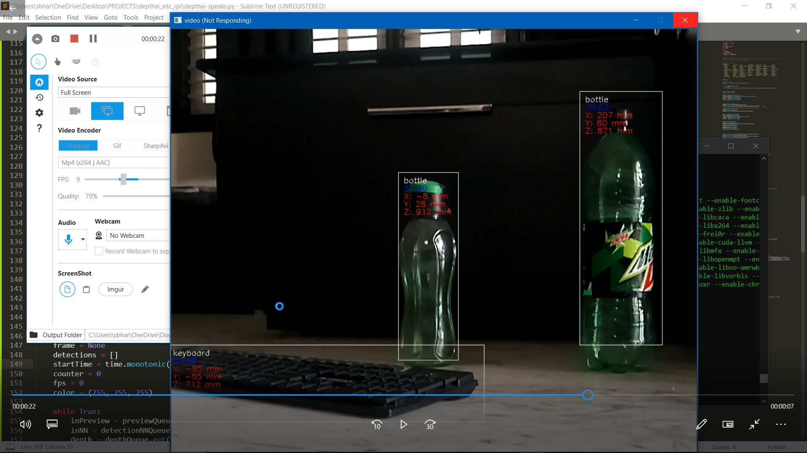

# depthai-speaks

**Adding a Speech synthesis and making oaks even more smarter..**

Speech synthesis is the artificial production of human speech. A computer system used for this purpose is called a speech computer or speech synthesizer, and can be implemented in software or hardware products. A text-to-speech (TTS) system converts normal language text into speech.

all we just need to install all dependencies, run the program and press 'd'

**This applications uses**\
adas\
robots\
and other smart systems\

**other deps used:**\
gtts\
pydub\
ffpmeg

windows users need extract the below zip folder and setup env variables  ,,
[ need to add bin folder to the PATH ]
ffmpeg-4.4-full_build.7z
39.4 MB Download

*here im using yolo for detections..*\
*demo:*

  
